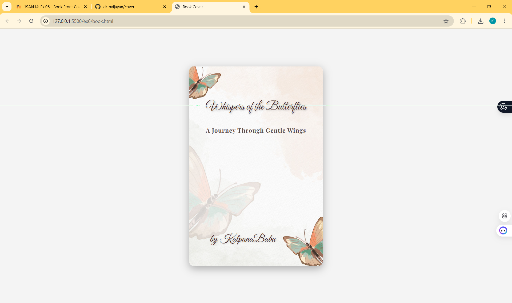

# Ex.06 Book Front Cover Page Design
## Date:
31.10.2025

## AIM:
To design a book front cover page using HTML and CSS.

## DESIGN STEPS:

### Step 1:
Create a Django Admin project.

### Step 2:
Create an app in the Django interface.

### Step 3:
Create a folder named 'static' in the app folder.

### Step 4:
Create a new HTML file in the static folder.

### Step 5:
Write the HTML code with relevant CSS properties.

### Step 6:
Choose the appropriate style and color scheme.

### Step 7:
Insert the images in their appropriate places.

### Step 8:
Publish the website in the LocalHost.

## PROGRAM:
```
<!DOCTYPE html>
<html lang="en">
<head>
<meta charset="UTF-8">
<meta name="viewport" content="width=device-width, initial-scale=1.0">
<title>Book Cover</title>


<link href="https://fonts.googleapis.com/css2?family=Great+Vibes&family=Playfair+Display:wght@700&display=swap" rel="stylesheet">

<style>
  body {
    margin: 0;
    padding: 0;
    background-color: #f4f4f4;
    display: flex;
    justify-content: center;
    align-items: center;
    height: 100vh;
  }

  .book-cover {
    position: relative;
    width: 400px;  
    height: 600px;  
    background-image: url('cover.jpg');
    background-size: cover;
    background-position: center;
    border-radius: 12px;
    box-shadow: 0 8px 25px rgba(0,0,0,0.3);
    text-align: center;
    overflow: hidden;
  }

  .title {
    position: absolute;
    top: 100px;
    width: 100%;
    font-family: 'Great Vibes', cursive;
    font-size: 35px;
    color: #4a2c2a;
    text-shadow: 2px 2px 5px rgba(0,0,0,0.3);
  }

  .subtitle {
    position: absolute;
    top: 180px;
    width: 100%;
    font-size: 18px;
    font-family: 'Playfair Display', serif;
    color: #5a4c4c;
    letter-spacing: 1px;
  }

  .author {
    position: absolute;
    bottom: 60px;
    width: 80%;
    font-family: 'Great Vibes', cursive;
    font-size: 32px;
    color: #4a2c2a;
    text-shadow: 1px 1px 5px rgba(0,0,0,0.2);
  }
</style>
</head>
<body>

  <div class="book-cover">
    <div class="title">Whispers of the Butterflies</div>
    <div class="subtitle">A Journey Through Gentle Wings</div>
    <div class="author">by KalpanaBabu </div>
  </div>

</body>
</html>
```


## OUTPUT:



## RESULT:
The program for designing book front cover page using HTML and CSS is completed successfully.
